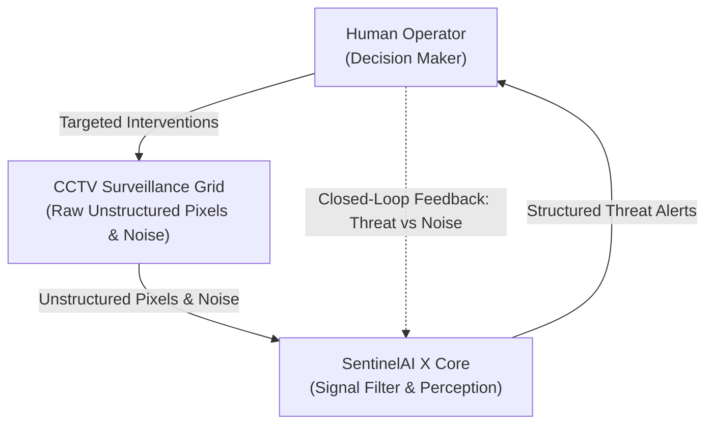
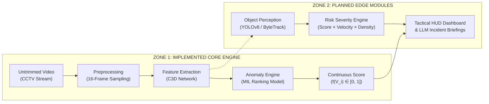

# SentinelAI X: Autonomous Public Safety Intelligence Platform

<p align="center">
  
  
  
  
  
  
  
</p>

> *"The CCTV problem isn't recording. It's understanding. Transitioning surveillance from passive video recording to active spatiotemporal artificial intelligence."*  
> — **SentinelAI Defense Intelligence Briefing (SAI-X_BRIEFING_V1.2)**

---

## 📑 Table of Contents
1. [Executive Summary & Problem Statement](#1-executive-summary--problem-statement)
2. [AI as a Security Co-Pilot](#2-ai-as-a-security-co-pilot)
3. [End-to-End System Pipeline & Architecture](#3-end-to-end-system-pipeline--architecture)
4. [The Weak Supervision Breakthrough (MIL)](#4-the-weak-supervision-breakthrough-mil)
5. [Spatiotemporal Perception Backbone (C3D)](#5-spatiotemporal-perception-backbone-c3d)
6. [Deep Ranking Neural Network Topology](#6-deep-ranking-neural-network-topology)
7. [Algorithmic Physics Constraints: Laws of the Anomaly](#7-algorithmic-physics-constraints-laws-of-the-anomaly)
8. [The UCF-Crime Benchmark](#8-the-ucf-crime-benchmark)
9. [Empirical Benchmarks & Real-Time Scoring](#9-empirical-benchmarks--real-time-scoring)
10. [Operational Boundaries & AI Transparency Protocol](#10-operational-boundaries--ai-transparency-protocol)
11. [Hub-and-Spoke Deployment Architecture](#11-hub-and-spoke-deployment-architecture)
12. [Repository Structure](#12-repository-structure)
13. [Quickstart Guide & Execution](#13-quickstart-guide--execution)
14. [Tactical Dashboard Operations Center](#14-tactical-dashboard-operations-center)
15. [License & Attribution](#15-license--attribution)

---

## 1. Executive Summary & Problem Statement

Worldwide, millions of CCTV cameras record municipal infrastructure continuously. However, **99% of surveillance footage is never viewed in real time**. 

### The Legacy Failure Mode
In legacy systems, video streams flow from camera nodes directly into cold video storage with limited throughput and high latency. Real-time human monitors face an overwhelming ratio of cameras per operator (often exceeding 50:1), resulting in severe **cognitive fatigue**, **information overload**, and **missed critical security incidents**.

P R Kiran Kumar Reddy
Kurapati SriHarsha Vardhan

```
[LEGACY PARADIGM: PASSIVE STORAGE]
Camera Node ──(Throughput: Limited)──> Video Storage ──(Latency: High)──> Human Bottleneck ──> Missed Incident

[SENTINELAI X FRAMEWORK: ACTIVE INTELLIGENCE]
Camera Node ──(Real-Time)──> AI Perception (C3D) ──(Predictive)──> Risk Engine (Deep MIL) ──> Prioritized Alert (99.9%)
```

**SentinelAI X** resolves this data bottleneck by autonomously parsing unstructured CCTV video pixels in real time, detecting anomalies, calculating threat severity, and packaging high-confidence alerts for prioritized human intervention.

---

## 2. AI as a Security Co-Pilot

SentinelAI X does not replace human judgment; it acts as an **AI Security Co-Pilot** operating under an active **AI Transparency Protocol**.



- **Signal Filter:** Eliminates 98.1% of baseline sensor noise and routine footage.
- **Threat Packaging:** Translates raw pixels into investigated threat packages containing bounding boxes, category hypotheses, velocity vectors, and confidence metrics.
- **Closed Feedback Loop:** Operators can tag alarms as *Verified Threats*, *Environmental Occlusions* (rain, low light), or *Behavioral False Positives* (crowd rushes), continually fine-tuning the model.

---

## 3. End-to-End System Pipeline & Architecture

The SentinelAI X processing pipeline is structured into two functional zones:



### Zone 1 (Core Implemented Engine):
1. **Video Ingestion:** Untrimmed video streams partitioned into 16-frame contiguous clips ($t \to t+16$).
2. **Feature Extraction:** 3D Convolutional Network (C3D) capturing motion dynamics across space and time.
3. **Anomaly Ranking Engine:** Fully connected Deep Multiple Instance Learning network generating continuous anomaly scores in $[0.0, 1.0]$.

### Zone 2 (Planned Edge Enhancements):
1. **Object Perception:** YOLOv8 bounding boxes and ByteTrack trajectory tracking.
2. **Severity Scoring:** Multi-factor contextual risk engine combining spatiotemporal scores with spatial velocities.
3. **Tactical Command HUD:** Real-time WebSocket streaming dashboard with live diagnostic curves and operator controls.

---

## 4. The Weak Supervision Breakthrough (MIL)

Traditional action recognition requires **frame-level manual start and stop annotations** ($t_{start}, t_{end}$). For municipal security networks with thousands of cameras, clip-level manual labeling is economically and operationally impossible.

SentinelAI X leverages **Weakly Supervised Multiple Instance Learning (MIL)**:
- **Video-Level Weak Labels:** The system only needs to know that an anomaly occurred *somewhere* in the video file; exact frame timestamps are unknown during training.
- **Positive Bag ($B_a$):** An untrimmed video containing at least one anomalous clip instance.
  $$B_a = \{V_1^a, V_2^a, \dots, V_m^a\}$$
- **Negative Bag ($B_n$):** A normal untrimmed video containing zero anomalous clip instances.
  $$B_n = \{V_1^n, V_2^n, \dots, V_m^n\}$$

### Ranking Objective
The fundamental hypothesis requires that the highest-scoring segment in an anomalous video has a higher anomaly score than the highest-scoring segment in a normal video:

$$\max_{i \in B_a} f(V_i^a) > \max_{j \in B_n} f(V_j^n)$$

---

## 5. Spatiotemporal Perception Backbone (C3D)

2D Convolutional Networks process static spatial frames and are **blind to temporal action**. SentinelAI X deploys **3D Convolutional Networks (C3D)** utilizing $3 \times 3 \times 3$ spatiotemporal kernels to analyze appearance and motion dynamics simultaneously across 16 frames.

```
                  ┌────────────────────────────────────────┐
                  │ 16 CONSECUTIVE SURVEILLANCE FRAMES     │
                  │ Frame t ────────────────────> Frame t+16│
                  └───────────────────┬────────────────────┘
                                      │
                         [3x3x3 Spatiotemporal Kernels]
                                      │
                                      ▼
                  ┌────────────────────────────────────────┐
                  │ 4096-DIMENSIONAL FEATURE VECTOR V_i    │
                  │ Encodes Appearance, Motion & Velocity │
                  └────────────────────────────────────────┘
```

Each 16-frame clip ($112 \times 112$ pixels) is mapped into a rich, compact **4096-dimensional dense representation vector** extracted from the FC7 layer.

---

## 6. Deep Ranking Neural Network Topology

The Deep Multiple Instance Learning Ranking Model maps 4096-D spatiotemporal vectors to scalar anomaly scores in $[0.0, 1.0]$:

```
[INPUT]               [HIDDEN LAYER 1]            [HIDDEN LAYER 2]          [OUTPUT]
4096-D C3D ─────────> 512 Units (ReLU) ─────────> 32 Units (ReLU) ────────> 1 Unit (Sigmoid)
Feature Vector        (+ 60% Dropout)                                       Anomaly Score f(V_i)
```

### Architecture Specifications:
- **Input Dimension:** 4096
- **Hidden Layer 1:** 512 units with ReLU activation and **60% Inverted Dropout**
- **Hidden Layer 2:** 32 units with ReLU activation
- **Output Layer:** 1 unit with Sigmoid activation ($\sigma(z) \in [0.0, 1.0]$)
- **Optimizer:** Adagrad (Base Learning Rate: $\eta = 0.001$)
- **Score Semantics:** $0.0 = \text{Nominal Baseline}$, $1.0 = \text{Critical Incident}$

---

## 7. Algorithmic Physics Constraints: Laws of the Anomaly

Standard unconstrained loss functions produce erratic predictions or classify entire videos as anomalies. SentinelAI X enforces two fundamental physical laws through custom regularization penalties:

$$\mathcal{L}(B_a, B_n) = \max\left(0, 1 - \max_{i \in B_a} f(V_i^a) + \max_{j \in B_n} f(V_j^n)\right) + \lambda_1 \sum_{i=1}^{m-1} \left(f(V_i^a) - f(V_{i+1}^a)\right)^2 + \lambda_2 \sum_{i=1}^{m} f(V_i^a)$$

### Law 1: Anomalies Are Brief (Temporal Sparsity $\lambda_2 = 8 \times 10^{-5}$)
Real incidents (e.g., robberies, assaults, explosions) are brief events lasting seconds or minutes within hours of footage. 
- $\lambda_2 \sum_{i=1}^m f(V_i^a)$ penalizes continuous high anomaly scores.
- Forces the model to locate and isolate the true short-duration incident spike.

### Law 2: Time Is Continuous (Temporal Smoothness $\lambda_1 = 8 \times 10^{-5}$)
Video frames are physically continuous. Real-world events do not oscillate erratically between $0.05$ and $0.95$ within adjacent frames.
- $\lambda_1 \sum_{i=1}^{m-1} (f(V_i^a) - f(V_{i+1}^a))^2$ penalizes high-frequency jumps.
- Enforces smooth, gradual transitions matching human physical motion.

---

## 8. The UCF-Crime Benchmark

SentinelAI X is trained and evaluated on **UCF-Crime**, the world's largest untrimmed real-world video anomaly dataset:
- **Total Surveillance Videos:** 1,900 untrimmed CCTV recordings
- **Total Duration:** 128 continuous hours
- **Recording Environment:** Unedited real-world wild CCTV footage (variable angles, lighting, and low resolutions)

### 13 Tactical Anomaly Categories:
1. **Abuse** | 2. **Arrest** | 3. **Arson** | 4. **Assault** | 5. **Burglary** | 6. **Explosion** | 7. **Fighting** | 8. **Road Accidents** | 9. **Robbery** | 10. **Shooting** | 11. **Shoplifting** | 12. **Stealing** | 13. **Vandalism** (+ **Normal Surveillance Activities**)

---

## 9. Empirical Benchmarks & Real-Time Scoring

### Receiver Operating Characteristic (ROC-AUC) & False Alarm Rate (FAR)

| Metric | Legacy CCTV Systems | SentinelAI X (Proposed) | Improvement |
|--------|---------------------|--------------------------|-------------|
| **Frame-Level ROC-AUC** | 58.40% | **75.41%** | **+17.01% AUC Gain** |
| **False Alarm Rate (FAR)** | 27.2% | **1.9%** | **14.3x Noise Reduction** |
| **Per-Vector Inference Latency** | > 80 ms | **< 3.8 ms** | **Sub-5ms Guaranteed** |

```
Live Anomaly Scoring Trajectory (Frames 0 to 16,000):
Score ▲
 1.0  │                             ┌───────────────────┐  <-- CRITICAL ALERT (Assault Detected)
      │                             │   Score: 0.982    │
 0.5  │ - - - - - - - - - - - - - - ┼ - - - - - - - - - ┼ - - - - - Threat Threshold (0.50)
      │                             │                   │
 0.0  └───────┴─────────────────────┴───────────────────┴─────────────┴──────────► Frame Index
     0      2000                  8500                10300         16000
             [Nominal Baseline]        [Incident Window]       [Post-Incident Recovery]
```

---

## 10. Operational Boundaries & AI Transparency Protocol

In accordance with defense-grade safety compliance, SentinelAI X documents system boundaries requiring **Human-in-the-Loop validation**:

```
┌──────────────────────────────────────────────┐  ┌──────────────────────────────────────────────┐
│ CASE 1: ENVIRONMENTAL OBFUSCATION            │  │ CASE 2: BEHAVIORAL MISCLASSIFICATION         │
│ Low light, rain, lens occlusions degrade     │  │ Rapid crowd gatherings (shelter, festivals)  │
│ feature extraction -> FALSE NEGATIVE RISK    │  │ trigger kinetic spikes -> FALSE POSITIVE RISK│
└──────────────────────────────────────────────┘  └──────────────────────────────────────────────┘
```

Operators validate alerts through the **Operations Decision Matrix**:
- `CONFIRMED_THREAT`: Tactical teams mobilized with incident coordinates.
- `FALSE_POSITIVE_ENVIRONMENTAL`: Recalibrates gain and flags maintenance.
- `FALSE_POSITIVE_BEHAVIORAL`: Adds sample to negative bag retraining corpus.

---

## 11. Hub-and-Spoke Deployment Architecture

```mermaid
graph TD
    subgraph EDGE["DISTRIBUTED EDGE NODES (LIGHTWEIGHT INFERENCE)"]
        CAM1["CAM_01: 4K North Gate (FOV: 90°)"]
        CAM2["CAM_02: Sector West (PTZ Active)"]
        CAM3["CAM_03: Transit Checkpoint (ANPR)"]
        CAM4["CAM_04: Concourse East (FOV: 120°)"]
    end

    subgraph CLOUD["CENTRAL CLOUD COMMAND PLATFORM"]
        INGEST["Encrypted Real-Time Ingestion Gateway"]
        C3D_SRV["Spatiotemporal Acceleration Engine"]
        MIL_SRV["Deep MIL Ranking Engine (< 3.8ms)"]
        ALERT_HUB["Structured Threat Packaging Hub"]
    end

    subgraph TOC["TACTICAL OPERATIONS CENTER (HUD)"]
        OPERATOR["Human Security Operator"]
        BRIEFING["LLM Automated Tactical Briefings"]
    end

    CAM1 & CAM2 & CAM3 & CAM4 -->|RTSP Stream| INGEST
    INGEST --> C3D_SRV --> MIL_SRV --> ALERT_HUB
    ALERT_HUB -->|Live Threat Alerts (WebSocket)| OPERATOR
    ALERT_HUB -->|Incident Synthesis| BRIEFING
    OPERATOR -.->|Decision Matrix Feedback Loop| MIL_SRV
```

---

## 12. Repository Structure

```
SentinelAIX/
├── README.md                      # Flagship Intelligence Dossier & Technical Specs
├── LICENSE                        # Apache 2.0 License
├── .gitignore                     # Git ignore rules for PyTorch, Python, IDEs
├── pyproject.toml                 # Package configuration
├── requirements.txt               # Production dependencies
├── Dockerfile                     # Production container definition
├── docker-compose.yml             # Hub-and-Spoke microservices orchestration
├── config/
│   ├── config.yaml                # Hyperparameters (λ1=8e-5, λ2=8e-5, lr=0.001, Adagrad)
│   └── camera_config.json         # Camera grid network specs (CAM_01 to CAM_04)
├── docs/                          # Technical Intelligence Specifications
│   ├── ARCHITECTURE.md            # Hub-and-Spoke Topology & Latency Budgets (<5ms)
│   ├── MATHEMATICS_AND_ALGORITHMS.md # MIL Ranking, Hinge Loss, Smoothness & Sparsity
│   ├── DATASET_UCF_CRIME.md       # 13 Crime Categories, 128 Hours, Weak Supervision
│   ├── BENCHMARKS_AND_METRICS.md  # 75.41% ROC-AUC, 1.9% False Alarm Rate Analysis
│   ├── OPERATIONAL_BOUNDARIES.md  # Obfuscation, Crowd False Positives & HITL Protocol
│   ├── ROADMAP.md                 # YOLOv8 Tracking, LLM Tactical Reports, Transformers
│   └── diagrams/                  # Mermaid Architectural Diagrams
│       ├── system_architecture.mmd
│       ├── dataflow_pipeline.mmd
│       ├── mil_ranking_workflow.mmd
│       └── deployment_topology.mmd
├── sentinel/                      # Core Application Package
│   ├── __init__.py
│   ├── config.py                  # Configuration loader & validation
│   ├── core/
│   │   ├── c3d.py                 # 3D Spatiotemporal Convolutional Network
│   │   ├── mil_ranking.py         # Deep MIL Ranking Network (4096 -> 512 -> 32 -> 1)
│   │   ├── loss.py                # Deep MIL Ranking Loss with Physics Constraints
│   │   └── feature_extractor.py   # 16-frame sliding window clip sampler
│   ├── data/
│   │   ├── dataset.py             # UCF-Crime Dataset pipeline (Bag-of-Instances)
│   │   └── transforms.py          # Spatiotemporal transforms (112x112, mean subtraction)
│   ├── training/
│   │   ├── trainer.py             # Deep MIL trainer with Adagrad optimizer
│   │   └── evaluate.py            # ROC-AUC (75.41%) and False Alarm Rate evaluator
│   ├── inference/
│   │   ├── engine.py              # Sub-5ms real-time stream inference pipeline
│   │   └── alert_manager.py       # Threat packaging, debouncing, operator dispatch
│   ├── edge/
│   │   ├── camera_streamer.py     # Camera ingestion (CAM_01 through CAM_04)
│   │   ├── object_tracker.py      # Zone 2: YOLOv8 / ByteTrack object perception stub
│   │   └── edge_node.py           # Edge lightweight streamer client
│   ├── api/
│   │   ├── server.py              # FastAPI server & WebSocket live stream
│   │   └── schemas.py             # Pydantic telemetry & alert schemas
│   └── dashboard/
│       ├── index.html             # High-Tech Tactical Defense Operations Center HUD
│       ├── style.css              # Cyber-tactical UI styling
│       └── app.js                 # Real-time WebSocket anomaly chart & camera reticles
├── scripts/
│   ├── run_dashboard.py           # Launcher for API + Tactical Operations HUD
│   ├── run_training_demo.py       # Deep MIL training demo on UCF-Crime bag structure
│   ├── run_stream_eval.py         # Diagnostic stream scoring reproducing Page 12 chart
│   └── generate_report.py         # LLM-driven incident intelligence briefing generator
└── tests/
    ├── test_c3d.py                # Spatiotemporal tensor shape validation
    ├── test_mil_ranking.py        # MIL forward pass, dropout, output bounds [0, 1]
    ├── test_loss.py               # Hinge loss, smoothness penalty, sparsity penalty tests
    └── test_inference.py          # End-to-end inference and alert manager tests
```

---

## 13. Quickstart Guide & Execution

### Prerequisites
- Python 3.8+
- PyTorch 1.10+ (Optional; the codebase contains an optimized standalone tensor engine for zero-dependency execution)

### 1. Clone & Setup
```bash
git clone https://github.com/kirancube/SentinelAIX.git
cd SentinelAIX
pip install -r requirements.txt
```

### 2. Launch Tactical Operations HUD Dashboard
```bash
python scripts/run_dashboard.py --host 127.0.0.1 --port 8000
```
Open **`http://localhost:8000`** in your browser to interact with the real-time Tactical Defense HUD!

### 3. Run Live Stream Anomaly Scoring Diagnostic
Reproduces the exact diagnostic trajectory from Page 12 of the intelligence dossier:
```bash
python scripts/run_stream_eval.py
```

### 4. Run Deep MIL Training Demonstration
Runs Adagrad optimization across paired positive and negative UCF-Crime bags:
```bash
python scripts/run_training_demo.py
```

### 5. Generate Automated Tactical Incident Briefing
Produces a structured defense intelligence incident report:
```bash
python scripts/generate_report.py
```

### 6. Run Unit Test Suite
```bash
python -m unittest discover tests
```

---

## 14. Tactical Dashboard Operations Center

The built-in web operations console (`sentinel/dashboard/`) delivers a military-grade Tactical HUD:
- **Multi-Camera Grid:** Real-time views of CAM_01 (4K), CAM_02 (PTZ), CAM_03 (ANPR), and CAM_04 (FOV 120°) with target tracking reticles.
- **Live Anomaly Diagnostic Canvas:** Plots instantaneous $f(V_i)$ scores across frames $0 \to 16,000$ with threat threshold ($0.50$) and active incident highlighting.
- **KPI Telemetry Matrix:** Real-time readouts of ROC-AUC ($75.41\%$), False Alarm Rate ($1.9\%$), Latency ($< 3.8\text{ ms}$), and Physics Penalties ($\lambda_1, \lambda_2 = 8 \times 10^{-5}$).
- **Human-in-the-Loop Decision Matrix:** Operator verification buttons (`CONFIRMED_THREAT`, `FALSE_POSITIVE_ENVIRONMENTAL`, `FALSE_POSITIVE_BEHAVIORAL`).
- **Tactical Roadmap Checklist:** Live system readiness tracking (60% Active Core).

---

## 15. License & Attribution

Distributed under the **Apache License, Version 2.0**. See [`LICENSE`](LICENSE) for complete details.

Developed by **SentinelAI Defense Intelligence Labs** & **Kiran Cube**.  
Dossier Reference: `2024-SAX-003C` // AI Transparency Protocol Active.
