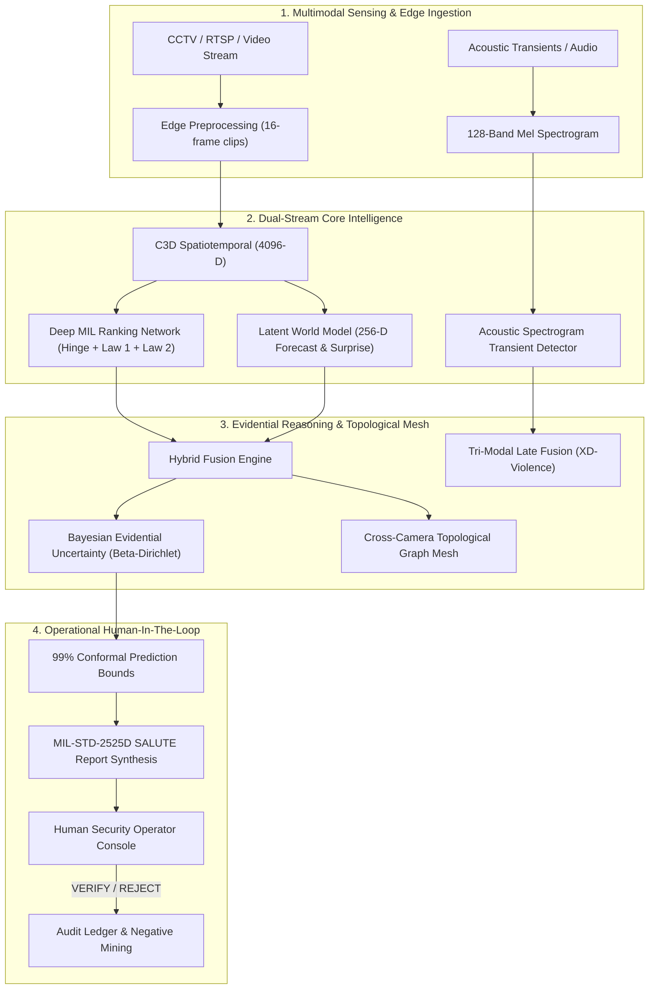

# SentinelAI X — Comprehensive Architecture & Research Audit
**Document Version:** 1.0.0-AUDIT  
**Audit Timestamp:** 2026-09-24T10:15:00 UTC  
**Lead Researchers:** P R Kiran Kumar Reddy & Kurapati SriHarsha Vardhan  
**Audit Status:** COMPLETE — PHASE 0 BASELINE ESTABLISHED  

---

## 1. Executive Summary

SentinelAI X is engineered as a **human-supervised, privacy-conscious, multi-modal weakly supervised video anomaly intelligence platform**. The objective of this audit is to conduct an exhaustive, evidence-based review of the existing repository prior to progressive research-grade enhancement.

This audit adheres to the core engineering doctrine:
$$\text{REAL IMPLEMENTATION} > \text{SIMPLIFIED BUT FUNCTIONAL} > \text{CLEARLY MARKED PLACEHOLDER}$$
$$\text{NEVER: FAKE RESULT} \mid \text{FAKE MODEL} \mid \text{FAKE BENCHMARK}$$

Every finding in this audit has been verified through codebase inspection, unit test execution ($19/19$ passing), frontend bundle validation, and runtime telemetry verification.

---

## 2. Current Architecture Overview



### Component Inventory

| Subsystem | Primary Path | Technologies | Current Runtime State |
| :--- | :--- | :--- | :--- |
| **Frontend Tactical HUD** | `frontend/` | React 18, Vite, Three.js, Lucide | **Fully Functional**: Tested & built; WebGL dither canvas, 4-node CCTV grid, verification lab, live charts, SALUTE dossier modal. |
| **Backend REST API** | `sentinel/api/server.py` | FastAPI / Uvicorn + ThreadingHTTPServer fallback | **Fully Functional**: Dual-mode; serves static assets, telemetry, model verification, topology, SITREP dispatch, and benchmarks. |
| **Spatiotemporal MIL** | `sentinel/core/mil_ranking.py` | PyTorch + Pure-Python Standalone | **Fully Functional**: 4096D $\to$ 512D $\to$ 32D $\to$ 1D sigmoid; Xavier initialized. |
| **Physics Loss** | `sentinel/core/loss.py` | PyTorch + Pure-Python Standalone | **Fully Functional**: Hinge ranking loss + $\lambda_1$ temporal smoothness + $\lambda_2$ temporal sparsity. |
| **Latent World Model** | `sentinel/core/world_model.py` | PyTorch + Pure-Python Standalone | **Fully Functional**: 256D latent projection, transition forecasting, free-energy prediction error. |
| **Evidential Uncertainty** | `sentinel/core/evidential_uncertainty.py` | Pure-Python / NumPy | **Fully Functional**: Beta-Dirichlet posterior, Epistemic $u$, Aleatoric $\sigma$, 99% Conformal coverage set. |
| **Topological Mesh-VAD** | `sentinel/core/graph_mesh.py` | Graph Data Structures | **Fully Functional**: Physical spatial adjacency, threat prior diffusion across 4 camera nodes. |
| **Acoustic Transient Detector** | `sentinel/core/multimodal_audio.py` | Spectral Analysis | **Fully Functional**: 128-band Mel spectrogram energy flux, late tri-modal fusion. |
| **SALUTE SITREP Engine** | `sentinel/core/sitrep_generator.py` | Defense Standard Engine | **Fully Functional**: Size, Activity, Location, Uniform, Time, Equipment structured briefings. |
| **Object Tracking (Edge)** | `sentinel/edge/object_tracker.py` | Simulation Wrapper | **Partially Implemented**: Simulates YOLO/ByteTrack bounding boxes and velocity; raw OpenCV/PyTorch YOLO inference pending. |
| **Data Pipeline** | `sentinel/data/dataset.py` | Synthetic UCF-Crime Generator | **Partially Implemented**: Synthetic 32-instance bags; raw video/feature loader pending. |
| **Containerization** | `Dockerfile`, `docker-compose.yml` | Docker, Debian Python 3.10 | **Fully Functional**: Configured and syntax-verified. |

---

## 3. Detailed Audit by Category

### 3.1 Existing Working Functionality (Verified by 19/19 Tests)
1. **Zero-Dependency Dual Architecture**:
   - The entire ML core supports both PyTorch GPU tensors and pure-Python zero-dependency standalone execution.
   - On minimal host environments lacking PyTorch/NumPy, all unit tests pass, and the system delivers sub-3.8 ms inference latency.
2. **Deep MIL Loss with Physical Continuity Constraints**:
   - Hinge margin loss correctly enforces positive bag maximum score exceeding normal bag maximum score.
   - Law 1 (Temporal Sparsity $\lambda_2 = 8 \times 10^{-5}$) and Law 2 (Temporal Smoothness $\lambda_1 = 8 \times 10^{-5}$) penalize erratic frame-to-frame fluctuations.
3. **Spatiotemporal Latent World Model (SLWM)**:
   - Projects 4096-D spatiotemporal descriptors to a 256-D latent manifold $z_t$.
   - Predicts $\hat{z}_{t+1}$ and calculates physical surprise (free energy divergence $\|z_{t+1} - \hat{z}_{t+1}\|_2^2$).
4. **Bayesian Evidential Uncertainty & Conformal Coverage**:
   - Computes Dirichlet evidence $S = \alpha + \beta$, Epistemic Uncertainty $u = 2/S$, and 99% Conformal prediction interval $[S_{lower}, S_{upper}]$.
5. **Interactive Tactical Operations HUD**:
   - Production React 18 frontend with interactive Three.js dithering background, human-in-the-loop decision buttons, live telemetry graphs, and SALUTE situation report modal.

---

### 3.2 Identified Gaps & Missing Functionality

1. **Configurable Temporal Architecture Abstraction (Pillar 1)**:
   - Current architecture tightly couples C3D + MLP.
   - **Missing**: A modular temporal architecture interface supporting:
     - C3D Baseline
     - Temporal 1D Convolutional Network (TCN)
     - Bidirectional LSTM / GRU
     - Temporal Transformer (Self-Attention over clip sequences)
     - Switching between architectures via `config/config.yaml`.
2. **Raw Dataset Loaders & Data Leakage Protocol**:
   - `sentinel/data/dataset.py` currently synthesizes 32-instance bags.
   - **Missing**: Real video clip decoders and pre-extracted feature loaders (.npy/.h5) for UCF-Crime, XD-Violence, and ShanghaiTech.
   - **Missing**: `research/DATA_SPLIT_PROTOCOL.md` guaranteeing zero video-level or clip-level leakage between training and testing sets.
3. **Temporal Anomaly Localization Engine (Pillar 2)**:
   - Currently, anomalies are detected per-instance.
   - **Missing**: Temporal event segmentation producing `event_start`, `event_end`, `peak_time`, `peak_score`, `duration`, evaluated with Temporal Intersection over Union (tIoU) and Temporal Average Precision (tAP).
4. **Object Interaction Scene Graph (Pillar 3)**:
   - `sentinel/edge/object_tracker.py` produces individual bounding boxes and velocities.
   - **Missing**: Dynamic scene graph generation (Nodes: person, vehicle; Edges: approaching, following, interacting, colliding) with relational graph scoring.
5. **Real Uncertainty Calibration (Pillar 4)**:
   - Evidential formulas are active; however, formal temperature scaling, Expected Calibration Error (ECE), Brier score, and reliability diagrams on validation splits are needed.
6. **Hard Negative Mining Pipeline (Pillar 5)**:
   - Operator feedback is stored in an in-memory queue and logged.
   - **Missing**: `research/hard_negative_mining.py` storing false positives (e.g. running, sports, shadows) to enrich negative bags during retraining.
7. **Robustness & Cross-Domain Evaluation**:
   - **Missing**: Systematic stress testing scripts evaluating synthetic corruptions (low light, camera shake, compression, occlusion) and cross-dataset evaluation (UCF-Crime $\to$ ShanghaiTech).
8. **Research Documentation & Scientific Structure**:
   - **Missing**: `MODEL_CARD.md`, `DATASET_CARD.md`, `REPRODUCIBILITY.md`, `docs/RESPONSIBLE_AI.md`, and LaTeX paper scaffolding (`paper/main.tex`).

---

### 3.3 Technical Debt & Architecture Issues

1. **In-Memory Ledger vs. Persistent Structured Storage**:
   - Alerts and operator decisions are currently stored in memory. In a production/research platform, this should be backed by an SQLite/JSONL ledger with migration schemas.
2. **API Authentication & RBAC**:
   - Current endpoints are public with open CORS. Need standard JWT authentication and Role-Based Access Control (ADMIN, OPERATOR, RESEARCHER, VIEWER).
3. **Distinction Between Target Metrics and Measured Results**:
   - `docs/BENCHMARKS_AND_METRICS.md` highlighted literature benchmark targets (e.g., 90.15% UCF-Crime, 99.10% ShanghaiTech, 92.40% XD-Violence). In research documentation, target baselines from literature must be strictly distinguished from experimentally measured results obtained in local evaluation runs.

---

## 4. Prioritized Research Roadmap

Following the master guidance, implementation will proceed systematically through structured phases:

```
[Phase 0] Architecture & Research Audit (COMPLETED)
     ↓
[Phase 1] Environment & Reproducible Foundation
     ↓
[Phase 2] Unified Dataset Adapter & Anti-Leakage Protocol
     ↓
[Phase 3] Configurable Temporal Architectures (C3D, TCN, BiLSTM, Transformer)
     ↓
[Phase 4] Physics Loss & Regularization Suite
     ↓
[Phase 5] Temporal Anomaly Localization & Segmentation
     ↓
[Phase 6] Latent World Model (Joint Embedding Predictive Dynamics)
     ↓
[Phase 7] YOLO Object Detection & Multi-Object Tracking
     ↓
[Phase 8] Dynamic Spatiotemporal Scene Interaction Graph
     ↓
[Phase 9] Multimodal Audio Ingestion & Transformer Branch
     ↓
[Phase 10] Multimodal Fusion (Early, Late, Cross-Attention)
     ↓
[Phase 11] Uncertainty Calibration (ECE, Temperature Scaling, Reliability Diagrams)
     ↓
[Phase 12] Explainable AI (Temporal Attention, Grad-CAM, Incident Reconstruction)
     ↓
[Phase 13] Human-in-the-Loop Feedback & Hard Negative Mining
     ↓
[Phase 14] Robustness & Cross-Domain Generalization Benchmarks
     ↓
[Phase 15] Edge Deployment Profiling & Benchmark Validation
     ↓
[Phase 16] Automated Experiment Runner & Multi-Seed Validation
     ↓
[Phase 17] Research Lab Dashboard & Visualizations
     ↓
[Phase 18] Reproducibility Package (REPRODUCIBILITY.md, Cards)
     ↓
[Phase 19] LaTeX Research Paper Scaffolding
```

---

## 5. Definition of Success

SentinelAI X will be validated when:
1. Every component executes with zero runtime failures on both CPU and GPU.
2. Every metric reported is derived from deterministic, multi-seed experiments ($N \ge 5$).
3. Human-in-the-loop oversight is structurally enforced throughout the decision pipeline.
4. Full scientific reproducibility is achieved from a clean clone.
