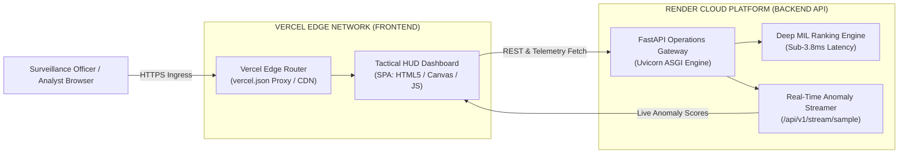

# SentinelAI X: Cloud Deployment Guide (Vercel + Render)

**Document Classification:** UNCLASSIFIED // DEFENSE INTEL  
**Architecture:** Decoupled Cloud Native (Vercel Frontend + Render Backend)  
**Status:** PRODUCTION READY

---



---

## 1. Deploy Backend on Render

The backend is configured as a production Python web service via [`render.yaml`](../render.yaml).

### Option A: One-Click Blueprint Deployment (Recommended)
1. Log into your [Render Dashboard](https://dashboard.render.com/).
2. Click **New +** &rarr; **Blueprint**.
3. Select your repository: `https://github.com/kirancube/SentinelAIX`.
4. Render will automatically detect `render.yaml` and configure:
   - **Service Name:** `sentinelaix-api`
   - **Runtime:** `Python 3.10`
   - **Build Command:** `pip install -r requirements.txt`
   - **Start Command:** `python scripts/run_dashboard.py --host 0.0.0.0 --port $PORT`
   - **Health Check Path:** `/health`
5. Click **Apply**.
6. Your backend will deploy at `https://sentinelaix-api.onrender.com` (or your chosen service URL).

### Option B: Manual Web Service Setup
- **Environment:** `Python 3`
- **Region:** `Oregon` or `Frankfurt`
- **Build Command:** `pip install -r requirements.txt`
- **Start Command:** `python scripts/run_dashboard.py --host 0.0.0.0 --port $PORT`
- **Environment Variables:**
  - `SYSTEM_MODE`: `central_cloud_command`
  - `ANOMALY_THRESHOLD`: `0.50`
  - `CRITICAL_THRESHOLD`: `0.85`

---

## 2. Deploy Frontend on Vercel

The frontend is completely decoupled in [`frontend/`](../frontend/) and at repository root via [`vercel.json`](../vercel.json).

### Option A: Via Vercel Web Dashboard
1. Log into your [Vercel Dashboard](https://vercel.com/dashboard).
2. Click **Add New...** &rarr; **Project**.
3. Select and import the `SentinelAIX` repository.
4. In **Project Settings**:
   - **Root Directory:** Edit and select `frontend` (or leave as `./` with root `vercel.json`).
   - **Framework Preset:** `Other`
5. Under **Environment Variables** (Optional if using default URL):
   - `BACKEND_API_URL`: `https://sentinelaix-api.onrender.com`
6. Click **Deploy**.
7. Vercel will instantly provision a global CDN URL (e.g. `https://sentinelaix.vercel.app`).

### Option B: Via Vercel CLI
```bash
# Install Vercel CLI
npm install -g vercel

# Navigate to frontend and deploy
cd frontend
vercel --prod
```

---

## 3. Verifying the Production Mesh

Once both services are active:
1. Verify backend health:
   ```bash
   curl -f https://sentinelaix-api.onrender.com/health
   # Expected response: {"status": "SYSTEM_ONLINE", "dossier_id": "2024-SAX-003C"}
   ```
2. Open your Vercel deployment URL in any desktop or mobile browser.
3. Observe live anomaly waveform rendering on HTML5 canvas with sub-4ms response, active camera feeds, and operator decision controls.
